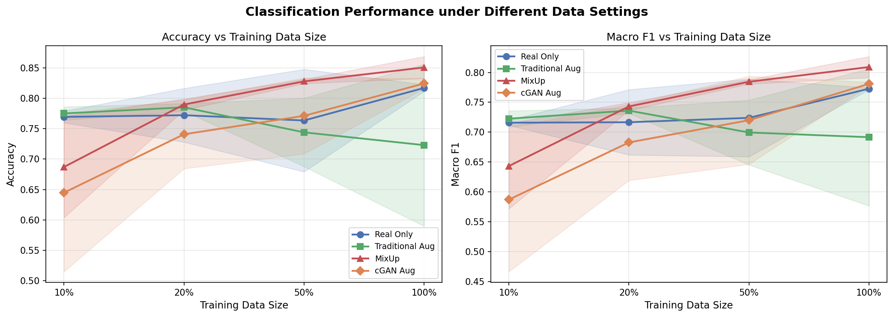
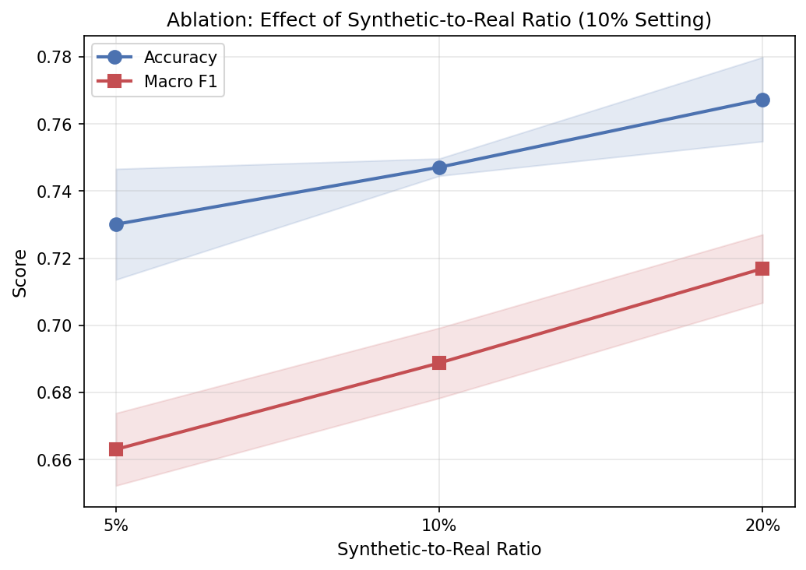
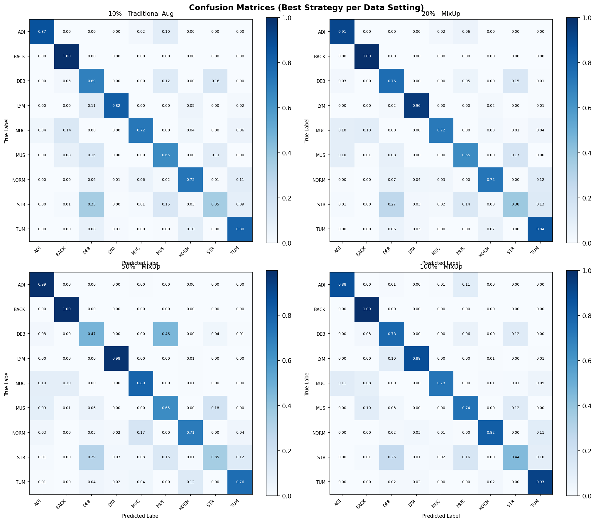

# Evaluating Conditional GAN-based Data Augmentation for Low-Resource Histopathology Image Classification

## Overview

This project investigates whether conditional GAN (cGAN)-generated synthetic histopathology images can improve classification performance under low-resource training settings. We evaluate four data augmentation strategies across four training data sizes on the PathMNIST dataset (MedMNIST v2).

## Research Question

> Can conditional GAN-generated synthetic histopathology images improve classification performance under low-resource training settings?

## Hypothesis

We hypothesized that GAN-based augmentation provides greater benefits under extremely limited training data (10–20%) than under data-rich settings.

## Dataset

| Attribute | Detail |
|-----------|--------|
| Dataset | PathMNIST (MedMNIST v2) |
| Classes | 9 (ADI, BACK, DEB, LYM, MUC, MUS, NORM, STR, TUM) |
| Image Size | 28 × 28 × 3 (RGB) |
| Train | ~89,996 |
| Val | ~10,004 |
| Test | ~7,180 |

## Experimental Setup

### Training Strategies

| Strategy | Description |
|----------|-------------|
| Real Only | Baseline, no augmentation |
| Traditional Aug | Random horizontal/vertical flip + rotation (±15°) |
| MixUp | Sample interpolation, α=0.2 following the original MixUp paper |
| cGAN Aug | Synthetic images generated by a Conditional DCGAN added to training set |

### Data Settings

| Setting | Approx. Images |
|---------|---------------|
| 10% | ~8,996 |
| 20% | ~17,992 |
| 50% | ~44,980 |
| 100% | ~89,996 |

### Evaluation Protocol

- **Training**: Stratified subsets (10% / 20% / 50% / 100%) of the official training split
- **Validation**: Official validation split (used for early stopping)
- **Testing**: Official test split (fixed across all experiments)
- **Metrics**: Accuracy, Macro F1, Balanced Accuracy, Confusion Matrix
- **Reliability**: All experiments repeated over 3 random seeds; results reported as Mean ± Std

### Ablation Study

Synthetic-to-real ratio ablation conducted under the most challenging low-resource setting (10%), where GAN augmentation was hypothesized to have the greatest impact.

| Ratio | Synthetic Images (10% setting) |
|-------|-------------------------------|
| 5% | ~441 |
| 10% | ~891 |
| 20% | ~1,791 |

## Model Architecture

**Classifier**: ResNet-18 (pretrained=False, 3-channel input, 9-class output)

**Generative Model**: We adopted a lightweight Conditional DCGAN as the generative backbone to focus on evaluating the effectiveness of synthetic data augmentation rather than proposing a novel GAN architecture.

## Results

### Main Experiment (Macro F1, Mean ± Std)

| Strategy | 10% | 20% | 50% | 100% |
|----------|-----|-----|-----|------|
| Real Only | 0.716 ± 0.003 | 0.717 ± 0.046 | 0.724 ± 0.055 | 0.773 ± 0.002 |
| Traditional Aug | 0.723 ± 0.012 | 0.736 ± 0.004 | 0.700 ± 0.034 | 0.692 ± 0.096 |
| MixUp | 0.643 ± 0.057 | 0.743 ± 0.005 | 0.784 ± 0.002 | 0.809 ± 0.016 |
| cGAN Aug | 0.587 ± 0.113 | 0.683 ± 0.065 | 0.720 ± 0.069 | 0.781 ± 0.003 |

### Ablation: Synthetic-to-Real Ratio (10% setting)

| Ratio | Accuracy | Macro F1 |
|-------|----------|----------|
| 5% | 0.730 ± 0.017 | 0.663 ± 0.011 |
| 10% | 0.747 ± 0.003 | 0.689 ± 0.010 |
| 20% | 0.767 ± 0.013 | 0.717 ± 0.010 |





## Key Findings

1. **cGAN augmentation did not consistently outperform the baseline under low-resource settings**, contrary to our hypothesis. We attribute this to GAN training instability under limited data, evidenced by high variance across seeds at the 10% setting (F1 std = 0.113).

2. **MixUp emerged as the most effective strategy**, showing consistent improvement with increasing data size and achieving the highest Macro F1 of 0.809 at 100%.

3. **Traditional augmentation degrades at high data volumes**, suggesting that simple geometric transforms introduce noise when training data is already sufficient.

4. **The ablation study reveals a consistent positive trend** with increasing synthetic-to-real ratio, suggesting that a higher ratio of synthetic data may further close the performance gap. Future work should explore ratios beyond 20%.

5. **BACK and ADI classes are consistently well-classified** across all settings, while STR remains the most challenging class due to visual similarity with DEB and MUS.

## Limitations and Future Work

- GAN training instability under low-resource settings remains a key challenge. Future work may incorporate more stable generative models such as Diffusion Models or StyleGAN.
- Perceptual metrics such as FID may be incorporated to better understand the relationship between generation quality and downstream classification performance.
- Ablation over synthetic-to-real ratios beyond 20% is left for future work.

## Repository Structure

```
cgan-augmentation-histopathology/
├── src/
│   ├── train_gan.py
│   ├── train_classifier.py
│   ├── augmentations.py
│   └── dataset.py
├── results/
│   └── figures/
│       ├── main_results_plot.png
│       ├── ablation_plot.png
│       └── confusion_matrices.png
├── notebooks/
│   └── experiments.ipynb
├── main_results.csv
├── ablation_results.csv
└── README.md
```

## Requirements

```
torch
torchvision
medmnist
scikit-learn
matplotlib
pandas
numpy
```

Install:

```bash
pip install torch torchvision medmnist scikit-learn matplotlib pandas numpy
```

## Reproducibility

All experiments were conducted on Kaggle Notebooks (Tesla T4 GPU). To reproduce:

```bash
# Install dependencies
pip install -r requirements.txt

# Run experiments (see notebooks/experiments.ipynb)
```

All random seeds are fixed (seeds: 42, 123, 7). Results may vary slightly across hardware.

## Citation

If you use this code or results, please cite the MedMNIST dataset:

```
Yang, J., Shi, R., Wei, D., Liu, Z., Zhao, L., Ke, B., Pfister, H., & Ni, B. (2023).
MedMNIST v2 - A large-scale lightweight benchmark for 2D and 3D biomedical image classification.
Scientific Data, 10(1), 41.
```

MixUp reference:

```
Zhang, H., Cisse, M., Dauphin, Y. N., & Lopez-Paz, D. (2018).
mixup: Beyond empirical risk minimization.
ICLR 2018.
```

## Author

[@yshy1015](https://github.com/yshy1015)
